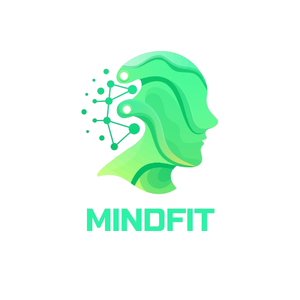

# MindFit - Aplicativo de Saúde e Bem-Estar



[](https://flutter.dev/)
[](https://firebase.google.com/)
[](https://developers.google.com/maps)

## 📱 Descrição do Projeto

**MindFit** é um aplicativo Android desenvolvido para promover saúde física, mental e bem-estar, alinhado à visão da Sociedade 5.0. Utilizando inteligência artificial e integração com APIs modernas, o MindFit oferece uma experiência personalizada com foco em atividade física, nutrição e equilíbrio emocional.

O aplicativo combina dados fisiológicos, psicológicos e contextuais para criar recomendações personalizadas, diferenciando-se de concorrentes como MyFitnessPal e Fitbit através de personalização avançada e um sistema integrado de saúde completo.

## ✨ Funcionalidades Principais

### 🏠 Dashboard Principal
- **Dados do usuário atual**: Visualização completa do perfil com dados mock
- **Resumo diário**: Calorias consumidas, treinos realizados e progresso
- **Gráficos interativos**: Acompanhamento visual do progresso de peso e metas
- **Cards informativos**: Acesso rápido às principais funcionalidades

### 💪 Sistema de Treinos Completo
- **Biblioteca de exercícios**: Catálogo extenso com descrições detalhadas
- **Planejador personalizado**: Criação de rotinas baseadas em objetivos
- **Acompanhamento de progresso**: Histórico detalhado de treinos realizados
- **Recomendações inteligentes**: Sugestões baseadas no perfil do usuário
- **Desafios semanais**: Metas gamificadas para manter a motivação

### 🗺️ Mapas e Localização
- **Integração Google Maps**: Visualização de locais próximos para atividades
- **Academias e parques**: Busca automática de locais para exercícios
- **Rotas de corrida**: Sugestões de percursos baseados na localização
- **Geolocalização**: Detecção automática da posição do usuário

### 🍎 API Nutricional Integrada
- **Base de dados alimentar**: Integração com API externa de nutrição
- **Contador de calorias**: Cálculo automático baseado nos alimentos consumidos
- **Análise de macronutrientes**: Distribuição de proteínas, carboidratos e gorduras
- **Histórico nutricional**: Acompanhamento detalhado da alimentação
- **Recomendações personalizadas**: Sugestões baseadas nas metas do usuário

### 🔥 Firebase Pré-configurado

- **FCM (Firebase Cloud Messaging)**:  
  Firebase já integrado para envio e recebimento de notificações push personalizadas para os usuários. O sistema está pronto para disparar lembretes e alertas relevantes diretamente no dispositivo, como:

    - **Lembrete de treino:**  
      `await sendLocalNotification('Hora do Treino!', 'Não esqueça do seu treino de hoje às 18:00');`

    - **Meta de água atingida:**  
      `await sendLocalNotification('Meta de Água Atingida!', 'Parabéns! Você bebeu 2L de água hoje 💧');`

    - **Dica nutricional:**  
      `await sendLocalNotification('Dica Nutricional', 'Que tal adicionar mais proteínas na sua próxima refeição?');`

  Além das notificações push via FCM, o app também suporta notificações locais, garantindo que o usuário receba lembretes e incentivos mesmo offline.

### 🎨 Layout Responsivo
- **Design moderno**: Interface intuitiva seguindo Material Design
- **Navegação fluida**: Bottom navigation e drawer menu organizados
- **Responsividade**: Adaptação para diferentes tamanhos de tela
- **Tema consistente**: Paleta de cores e tipografia padronizadas

## 🧪 Como Testar o Aplicativo

### Credenciais de Teste
Para acessar o aplicativo, utilize as seguintes credenciais:
```
Usuário: test
Senha: test
```

**⚠️ IMPORTANTE**: O sistema de autenticação atual é um mock para demonstração. Qualquer combinação de usuário/senha funcionará, mas recomendamos usar as credenciais acima para testes consistentes.

### Fluxo de Teste Recomendado
1. **Login**: Use as credenciais de teste
2. **Dashboard**: Explore os dados mock do usuário
3. **Treinos**: Navegue pela biblioteca e crie uma rotina
4. **Mapas**: Visualize locais próximos (requer localização)
5. **Nutrição**: Teste o contador de calorias
6. **Perfil**: Visualize e edite informações do usuário

## 🍔 API de Calorias - Integração Nutricional

### Como Funciona
O MindFit integra-se com uma API externa de nutrição para fornecer dados precisos sobre alimentos:

- **Base de dados**: Acesso a milhares de alimentos com informações nutricionais
- **Busca inteligente**: Sistema de busca que reconhece nomes populares e científicos
- **Cálculo automático**: Conversão automática de porções para valores nutricionais
- **Cache local**: Armazenamento local dos alimentos mais consultados para performance

### Funcionalidades da API
- Busca por nome do alimento
- Informações detalhadas de macronutrientes
- Cálculo de calorias por porção
- Dados de vitaminas e minerais
- Sugestões de alimentos similares

### Limitações Atuais
- Dependência de conexão com internet
- Base de dados focada em alimentos internacionais
- Algumas traduções podem não estar disponíveis


## 🚀 Como Executar o Projeto

### Pré-requisitos
- Flutter SDK (versão 3.0 ou superior)
- Android Studio ou VS Code
- Dispositivo Android ou emulador
- Conexão com internet

### Passos para Execução

1. **Clone o repositório**:
   ```bash
   git clone https://github.com/Freitassync/MindfitV2.git
   cd MindfitV2
   ```

2. **Instale as dependências**:
   ```bash
   flutter pub get
   ```

3. **Execute o aplicativo**:
   ```bash
   flutter run
   ```

### Resolução de Problemas Comuns
- **Erro de dependências**: Execute `flutter clean` e depois `flutter pub get`

## 🛠️ Tecnologias Utilizadas

### Framework e Linguagem
- **Flutter 3.x**: Framework principal para desenvolvimento multiplataforma
- **Dart**: Linguagem de programação

### Gerenciamento de Estado
- **Provider Pattern**: Gerenciamento reativo de estado
- **ChangeNotifier**: Para notificação de mudanças

### APIs e Serviços
- **Google Maps API**: Integração de mapas e geolocalização
- **Firebase**: Backend-as-a-Service para autenticação e dados
- **API Nutricional**: Serviço externo para dados de alimentos
- **Geolocator**: Plugin para localização do dispositivo

### UI/UX
- **Material Design**: Design system do Google
- **Custom Widgets**: Componentes personalizados reutilizáveis
- **Responsive Design**: Adaptação para diferentes telas

### Persistência de Dados
- **SharedPreferences**: Armazenamento local de preferências
- **Cache local**: Otimização de performance

## 🏗️ Arquitetura do Projeto

### Padrão Provider
O projeto utiliza o padrão Provider para gerenciamento de estado, oferecendo:
- **Separação de responsabilidades**: Lógica de negócio separada da UI
- **Reatividade**: Atualizações automáticas da interface
- **Testabilidade**: Facilita testes unitários e de integração
- **Escalabilidade**: Estrutura preparada para crescimento

### Providers Implementados
- **AuthProvider**: Gerenciamento de autenticação e sessão
- **UserProvider**: Dados e preferências do usuário
- **WorkoutProvider**: Lógica de treinos e exercícios
- **LocationProvider**: Geolocalização e mapas
- **NotificationProvider**: Sistema de notificações


## 🗺️ Roadmap Futuro

### Próximas Implementações

#### 🔐 Sistema de Autenticação Real
- **Firebase Authentication**: Implementação completa com email/senha
- **Login social**: Google, Facebook, Apple
- **Recuperação de senha**: Sistema de reset via email
- **Verificação de email**: Confirmação de conta
- **Perfis de usuário**: Dados persistentes na nuvem

#### 🤖 Inteligência Artificial
- **Chatbot assistente**: IA para suporte e motivação
- **Recomendações personalizadas**: ML para sugestões de treino
- **Análise de padrões**: Identificação de hábitos do usuário
- **Predição de resultados**: Estimativas baseadas em dados históricos

#### 📊 Analytics Avançado
- **Dashboard administrativo**: Métricas de uso do app
- **Relatórios personalizados**: Análises detalhadas para usuários
- **Comparações sociais**: Benchmarks com outros usuários
- **Metas inteligentes**: Objetivos adaptativos baseados em progresso

#### 🔔 Notificações Inteligentes
- **Push notifications**: Lembretes personalizados
- **Gamificação**: Sistema de conquistas e badges
- **Motivação contextual**: Mensagens baseadas em comportamento
- **Integração com wearables**: Dados de dispositivos vestíveis

#### 🌐 Funcionalidades Sociais
- **Comunidade**: Grupos de usuários com objetivos similares
- **Desafios coletivos**: Competições entre amigos
- **Compartilhamento**: Posts de conquistas e progresso
- **Mentoria**: Sistema de acompanhamento por especialistas

### Melhorias Técnicas
- **Testes automatizados**: Cobertura completa de testes
- **CI/CD**: Pipeline de integração e deploy contínuo
- **Performance**: Otimizações de velocidade e consumo
- **Acessibilidade**: Suporte completo para usuários com deficiência
- **Internacionalização**: Suporte a múltiplos idiomas


## 📄 Licença

Este projeto está licenciado sob a Licença MIT - veja o arquivo [LICENSE](LICENSE) para detalhes.


---

**MindFit** - Transformando vidas através da tecnologia e bem-estar 💪🧠❤️

*Versão atual: 2.0.0 | Última atualização: Junho 2025*